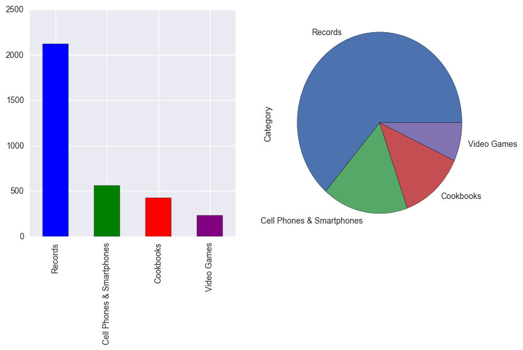
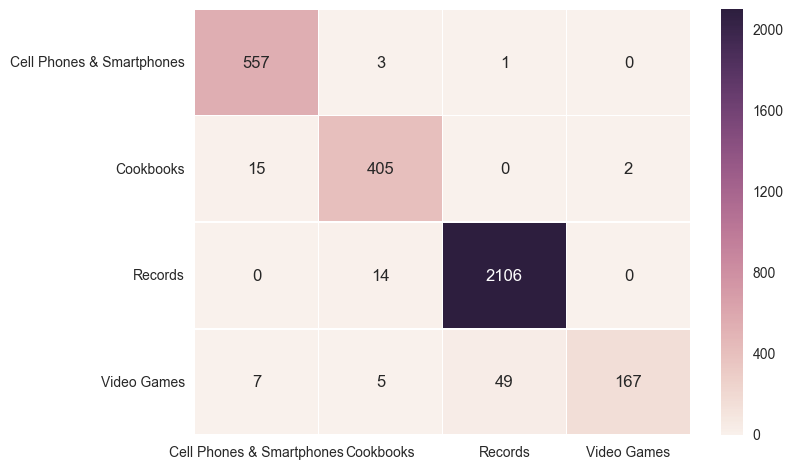
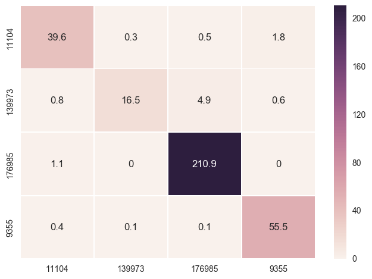
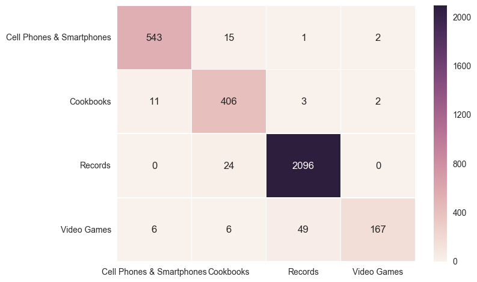

# Final project

our goal is to find and classify item descriptions from eBay and generate a new description for every classification we have (three categories).

Importing the packages we need


```python
import numpy as np
import pandas as pd
import ebaysdk
from ebaysdk.finding import Connection as finding
import pickle
import matplotlib.pyplot as plt
import plotly.graph_objs as go
import nltk
from nltk.corpus import stopwords
from sklearn import cross_validation
from sklearn.cross_validation import KFold
from sklearn.metrics import confusion_matrix
from sklearn.feature_extraction.text import TfidfVectorizer
import seaborn as sn

from sklearn.svm import SVC
import sklearn.naive_bayes as nb
from sklearn import neighbors 
from sklearn.tree import DecisionTreeClassifier
```

## Part a: collecting the data

We use ebay sdk package in order to collect all the records from three categories - Cookbooks (11104), Records (176985), Video Games (139973), Cell Phones & Smartphones (9355). From each page we can take max 100 items so we loop over 20 pages, that gives us a total of max 2000 records.


```python
def collect_data(cat_id):
    try:
        for pn in range (1,50):
            api.execute('findItemsAdvanced', {'categoryId' : cat_id, 
                                              'paginationInput': {'entriesPerPage': '100', 'pageNumber': pn}})
            dictstr = api.response_dict()
            for item in dictstr.searchResult.item:
                item_id.append(item.itemId)
                title.append(item.title)
                cat.append(item.primaryCategory.categoryName)
    except AttributeError:
        print "total pages available: ", pn
```

Inserting all the records into a Data Frame


```python
df = pd.DataFrame()
api = finding(domain='svcs.sandbox.ebay.com', appid='MaayanMa-DSprojec-SBX-e8e06383e-67abf65d', config_file=None)
item_id, title, cat = [], [], []
collect_data(['9355','139973'])
collect_data(['11104','176985'])
df['ItemID'] = item_id
df['Title'] = title
df['Category'] = cat
```

    total pages available:  44
    total pages available:  37
    

Looking at our database


```python
df.head(10)
```


<div>
<table border="1" class="dataframe">
  <thead>
    <tr style="text-align: right;">
      <th></th>
      <th>Title</th>
      <th>Category</th>
    </tr>
  </thead>
  <tbody>
    <tr>
      <th>0</th>
      <td>Apple iPhone 6 Plus 64GB Space Gray LTE Cellul...</td>
      <td>Cell Phones &amp; Smartphones</td>
    </tr>
    <tr>
      <th>1</th>
      <td>Apple iPhone 5S 16GB Space Gray LTE Cellular A...</td>
      <td>Cell Phones &amp; Smartphones</td>
    </tr>
    <tr>
      <th>2</th>
      <td>Apple iPhone 6 64GB Space Gray LTE Cellular AT...</td>
      <td>Cell Phones &amp; Smartphones</td>
    </tr>
    <tr>
      <th>3</th>
      <td>Apple iPhone 6 64GB Silver LTE Cellular AT&amp;T M...</td>
      <td>Cell Phones &amp; Smartphones</td>
    </tr>
    <tr>
      <th>4</th>
      <td>Apple iPhone 5S 16GB Silver LTE Cellular Sprin...</td>
      <td>Cell Phones &amp; Smartphones</td>
    </tr>
    <tr>
      <th>5</th>
      <td>Apple iPhone 5 16GB Black LTE Cellular Straigh...</td>
      <td>Cell Phones &amp; Smartphones</td>
    </tr>
    <tr>
      <th>6</th>
      <td>Apple iPhone 6 16GB Gold LTE Cellular Sprint M...</td>
      <td>Cell Phones &amp; Smartphones</td>
    </tr>
    <tr>
      <th>7</th>
      <td>Apple iPhone 6 128GB Gold LTE Cellular Verizon...</td>
      <td>Cell Phones &amp; Smartphones</td>
    </tr>
    <tr>
      <th>8</th>
      <td>Apple iPhone 6 Plus 64GB Silver LTE Cellular S...</td>
      <td>Cell Phones &amp; Smartphones</td>
    </tr>
    <tr>
      <th>9</th>
      <td>Apple iPhone 6S 64GB Space Gray LTE Cellular A...</td>
      <td>Cell Phones &amp; Smartphones</td>
    </tr>
  </tbody>
</table>
</div>


Drop duplicates if exists. We will find duplicates according to ItemID


```python
print "number of rows before: ", df.shape[0]
df.drop_duplicates(subset='ItemID', keep='first', inplace=True)
print "number of rows after: ", df.shape[0]
df = df.drop('ItemID',axis = 1)
```

    number of rows before:  6392
    number of rows after:  3331
    

Checking if there are NULLs that needs to be fixed


```python
df.isnull().sum()
```


    Title       0
    Category    0
    dtype: int64


There are no NULL values in our data.

Let's look at our Categories - how many do we have from each one and what part do they take. 


```python
print df.groupby('Category').count()
df['Category'] = df['Category'].astype('category')
colors = ['blue', 'green','red','purple']
labels = df.Category.unique()
fig = plt.figure(figsize=(10,5))
ax1 = fig.add_subplot(121)
df['Category'].value_counts().plot(kind='bar', color = colors)
ax2 = fig.add_subplot(122)
df['Category'].value_counts().plot(kind = 'pie')
plt.show()
```

                               Title
    Category                        
    Cell Phones & Smartphones    561
    Cookbooks                    422
    Records                     2120
    Video Games                  228
    





Saving our database in a pickle file for later use


```python
df.to_pickle(r'data')
```

## Part b: building a classifier

first, we will load our database from the last part


```python
df = pd.read_pickle(r'data')
df.head(5)
```


<div>
<table border="1" class="dataframe">
  <thead>
    <tr style="text-align: right;">
      <th></th>
      <th>Title</th>
      <th>Category</th>
    </tr>
  </thead>
  <tbody>
    <tr>
      <th>0</th>
      <td>Apple iPhone 6 Plus 64GB Space Gray LTE Cellul...</td>
      <td>Cell Phones &amp; Smartphones</td>
    </tr>
    <tr>
      <th>1</th>
      <td>Apple iPhone 5S 16GB Space Gray LTE Cellular A...</td>
      <td>Cell Phones &amp; Smartphones</td>
    </tr>
    <tr>
      <th>2</th>
      <td>Apple iPhone 6 64GB Space Gray LTE Cellular AT...</td>
      <td>Cell Phones &amp; Smartphones</td>
    </tr>
    <tr>
      <th>3</th>
      <td>Apple iPhone 6 64GB Silver LTE Cellular AT&amp;T M...</td>
      <td>Cell Phones &amp; Smartphones</td>
    </tr>
    <tr>
      <th>4</th>
      <td>Apple iPhone 5S 16GB Silver LTE Cellular Sprin...</td>
      <td>Cell Phones &amp; Smartphones</td>
    </tr>
  </tbody>
</table>
</div>


This function plots a confusion matrix


```python
def plot_cnf_matrix(cms, classes, model_name, vec_size):
    df_cm = pd.DataFrame(cms, index = classes, columns = classes)
    plt.figure(figsize = (5,5))
    fig, ax = plt.subplots()
    ax = sn.heatmap(df_cm, annot=True, linewidths=.5, fmt='g')
    print model_name, " for ", vec_size, "features"
    plt.show()
```

This function returns the train and test sets


```python
def extract_test_set(df, numOfFeatures, RemoveStopWords):
    stops = set(stopwords.words('english'))
    corpus = np.array(df.Title.values).tolist()
    target = np.array(df['Category'].values)
    if RemoveStopWords:
        vectorizer = TfidfVectorizer(stop_words='english', max_features=numOfFeatures, analyzer='word', ngram_range=(1, 1))
    else:
        vectorizer = TfidfVectorizer(max_features=numOfFeatures, analyzer='word', ngram_range=(1, 1))
    
    X = vectorizer.fit_transform(corpus)
#    global feature_names
    feature_names = vectorizer.get_feature_names()
    return X, target, feature_names
```

This function classifies a given model on a given data and target


```python
def Classify(vector_length, model, data, target, kf, mod_name,plot_cn):
    cm = []
    error = []
    for train_indices, test_indices in kf:
        # Get the dataset; this is the way to access values in a pandas DataFrame
        train_X = data[train_indices, :]
        train_Y = target[train_indices]
        test_X = data[test_indices, :]
        test_Y = target[test_indices]
        # Train the model
        model.fit(train_X, train_Y)
        predictions = model.predict(test_X)
        # Evaluate the model
        classes = model.classes_                
        cm.append(confusion_matrix(test_Y, predictions, labels=classes))
        error.append(model.score(test_X, test_Y))
    accuracy = np.mean(error)
    if plot_cn == True:
        for i in range(0,9):
            cms = np.mean(cm, axis=0)
        cms = cms * kf.n_folds
        plot_cnf_matrix(cms, classes, mod_name, vector_length)
    return accuracy
```

First, we will check four algorithms with different vector sizes in order to determin which combinations gives us a good result


```python
vector_length = [5, 7, 10, 20, 50, 100]

nbayes = nb.MultinomialNB()
dtree = DecisionTreeClassifier(random_state=0, max_depth=20)
svm = SVC(decision_function_shape='ovo',kernel='linear')
knn = neighbors.KNeighborsClassifier()

models = [nbayes, dtree, knn, svm]
mod_names = ['Naive Bayes', 'DT', 'KNN', 'Linear SVM']

nfolds = 10

a = {'Classifer': pd.Series(index=mod_names),}
scoreTable = pd.DataFrame(a)
scoreTable.__delitem__('Classifer')

for vl in vector_length:
    data, target, features = extract_test_set(df, vl, False)
    kf = KFold(data.shape[0], n_folds = nfolds, shuffle = True, random_state = 1)
    accuracies = []
    index = 0
    for mod in models:
        accuracies.append(Classify(vl, mod, data, target, kf, mod_names[index], False))
        index += 1
    scoreTable[vl] = accuracies

print scoreTable
```

                      5         7         10        20        50        100
    Naive Bayes  0.685983  0.680576  0.771844  0.874813  0.948361  0.958269
    DT           0.904230  0.909036  0.915939  0.949261  0.967874  0.968175
    KNN          0.901828  0.910237  0.913237  0.944456  0.964874  0.964274
    Linear SVM   0.904831  0.912337  0.916840  0.949862  0.969976  0.971177
    

We can see that a vector length of 20 gives us an accuracy that is over 80% with all four algorithms.
now, we'll look at some confusion matrices. Each number represents a single item.

The first confusion matrix will be with Naive Bayes:


```python
accuracies.append(Classify(20, nbayes, data, target, kf, 'Naive Bayes', True))
```

    Naive Bayes  for  20 features
    


    <matplotlib.figure.Figure at 0x10da3908>


We can see that our classifier is accurate at most with the records category, maybe because it has a lot more items than the rest. The biggest error is when classifying video games as records (55 items).

The second confusion matrix will be with Linear SVM:


```python
accuracies.append(Classify(20, svm, data, target, kf, 'Linear SVM', True))
```

    Linear SVM  for  20 features
    


    <matplotlib.figure.Figure at 0xf06c208>





We can see that this model classify cell phones and smartphones better than the first model, but comfuses more with video games classification.

The third confusion matrix will be with deceision tree:


```python
accuracies.append(Classify(20, dtree, data, target, kf, 'DT', True))
```

    DT  for  20 features
    


    <matplotlib.figure.Figure at 0xf200208>





DT has approximately the same results as SVM.

The last confusion matrix will be with KNN:


```python
accuracies.append(Classify(20, knn, data, target, kf, 'KNN', True))
```

    KNN  for  20 features
    


    <matplotlib.figure.Figure at 0xea110f0>





KNN has the biggest error in classifying records (2 times than the other models).
